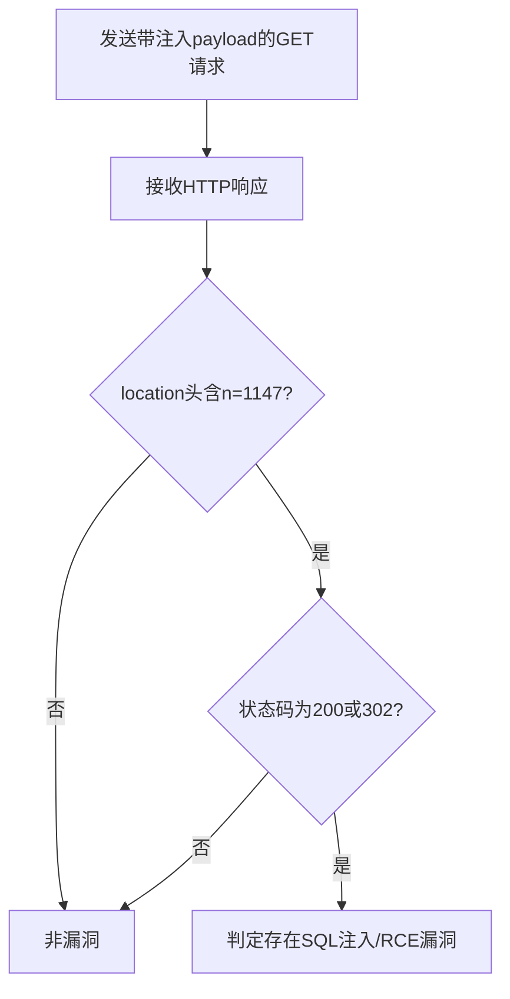

# 帆软 FineReport SQL注入导致远程代码执行漏洞（finereport-sqli-rce）检测说明

## 漏洞简介

帆软 FineReport 存在SQL注入漏洞，攻击者可通过/webroot/decision/view/ReportServer接口的n参数注入SQL语句，进而实现远程代码执行（RCE）。该漏洞源于产品自带的sqlite-jdbc驱动处理不当。

## 影响范围

- 产品：帆软 FineReport
- CVE编号：无（社区编号 finereport-sqli-rce）
- 危害等级：Critical

## 漏洞原理

/webroot/decision/view/ReportServer接口的n参数未做有效过滤，攻击者可注入SQL表达式，利用sqlite-jdbc驱动的特性，执行任意SQL甚至远程代码。

## 利用方式与攻击流程

1. 攻击者构造带有SQL注入payload的GET请求，n参数传入表达式如`${sum(1024,123)}`。
2. 服务器端未对参数进行安全处理，直接拼接执行SQL。
3. 数据库执行恶意SQL，返回特征数据。
4. 攻击者分析响应内容，确认漏洞存在。

## 探测原理与流程

### 探测请求的构造

```http
GET /webroot/decision/view/ReportServer?test=&n=${sum(1024,123)} HTTP/1.1
Host: target.com
Content-Type: application/x-www-form-urlencoded
```

- n参数注入了`${sum(1024,123)}`，用于判断是否存在注入点。

### 预期响应与交互

- 响应的location头中包含`report?test=&n=1147`（1024+123=1147），表明表达式被执行。
- HTTP状态码为200或302。

### 判定逻辑

```python
def is_vulnerable(response):
    if 'report?test=&n=1147' in response.headers.get('location', '') and response.status_code in [200, 302]:
        return True
    return False
```

### 检测流程Mermaid图



## 参考链接

- [POC与分析文章](https://github.com/wy876/POC/blob/main/%E5%B8%86%E8%BD%AF%E7%B3%BB%E7%BB%9FReportServer%E5%AD%98%E5%9C%A8SQL%E6%B3%A8%E5%85%A5%E6%BC%8F%E6%B4%9E%E5%AF%BC%E8%87%B4RCE.md) 