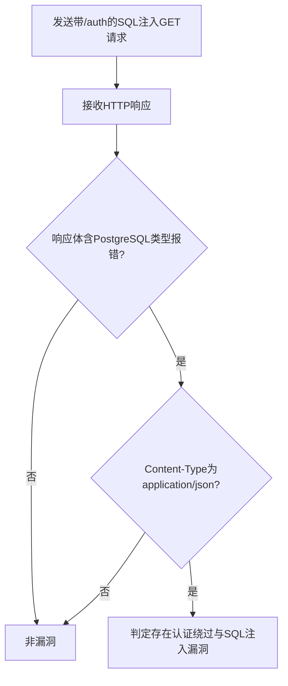

# pREST < 1.5.4 认证绕过与SQL注入漏洞（prest-sqli-auth-bypass）检测说明

## 漏洞简介

pREST 1.5.4 之前版本存在认证绕过与SQL注入漏洞。由于JWT白名单配置错误，攻击者可绕过认证并通过特定路径注入SQL语句，获取数据库敏感信息。

## 影响范围

- 产品：pREST
- 影响版本：< 1.5.4
- CVE编号：无（社区编号 prest-sqli-auth-bypass）
- 危害等级：Critical

## 漏洞原理

JWT白名单配置采用正则表达式后，攻击者可访问包含`/auth`的任意路径绕过认证。结合SQL注入payload，可在无需授权的情况下注入SQL语句，触发数据库报错并泄露信息。

## 利用方式与攻击流程

1. 攻击者构造带有SQL注入payload的GET请求，路径中包含`/auth`以绕过认证。
2. 服务器端未对路径和参数进行安全处理，直接拼接执行SQL。
3. 数据库执行恶意SQL，返回特征报错信息。
4. 攻击者分析响应内容，确认漏洞存在。

## 探测原理与流程

### 探测请求的构造

```http
GET /{database}/information_schema".tables)s%20where%201=version()::int--/auth HTTP/1.1
Host: target.com
```

- 路径中`/auth`用于绕过认证，SQL注入payload触发PostgreSQL类型转换报错。

### 预期响应与交互

- 响应体需包含`pq: invalid input syntax for type integer: "PostgreSQL `。
- Content-Type为`application/json`。

### 判定逻辑

```python
def is_vulnerable(response):
    if 'pq: invalid input syntax for type integer: "PostgreSQL ' in response.text and 'application/json' in response.headers.get('content-type', ''):
        return True
    return False
```

### 检测流程Mermaid图



## 参考链接

- [GitHub Advisory - GHSA-wm25-j4gw-6vr3](https://github.com/advisories/GHSA-wm25-j4gw-6vr3) 