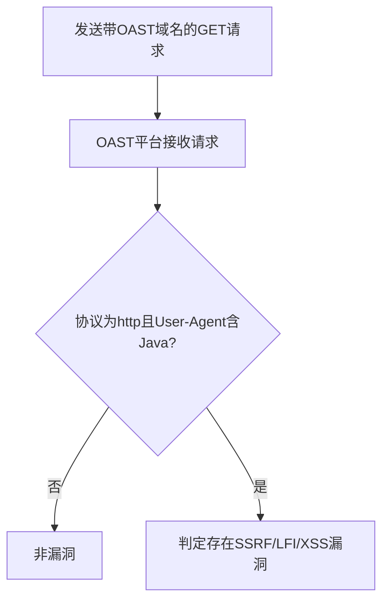

# VMware vCenter SSRF/LFI/XSS 漏洞（vmware-vcenter-ssrf）检测说明

## 漏洞简介

VMware vCenter 7.0.2.00100 存在多种高危漏洞，包括服务端请求伪造（SSRF）、本地文件包含（LFI）和跨站脚本（XSS）。攻击者可利用这些漏洞访问内网资源、读取本地文件或执行恶意脚本。

## 影响范围

- 产品：VMware vCenter
- 影响版本：7.0.2.00100
- CVE编号：无（社区编号 vmware-vcenter-ssrf）
- 危害等级：Critical

## 漏洞原理

`/ui/vcav-bootstrap/rest/vcav-providers/provider-logo` 接口的 `url` 参数未做有效校验，攻击者可传入任意外部或本地地址，导致SSRF、LFI或XSS攻击。

## 利用方式与攻击流程

1. 攻击者构造带有恶意url参数的GET请求，将url指向外部可控服务器（如interactsh）。
2. vCenter服务端发起请求访问该url，触发SSRF。
3. 攻击者通过OAST平台（如interactsh）接收到请求，确认漏洞存在。

## 探测原理与流程

### 探测请求的构造

```http
GET /ui/vcav-bootstrap/rest/vcav-providers/provider-logo?url=https://<oast域名> HTTP/1.1
Host: target.com
```

- url参数指向OAST平台域名，用于检测SSRF。

### 预期响应与交互

- OAST平台收到来自目标的HTTP请求，User-Agent包含`Java`。
- interactsh平台记录到`http`协议请求和`User-Agent: Java`。

### 判定逻辑

```python
def is_vulnerable(interactsh_result):
    if 'http' in interactsh_result['protocol'] and 'User-Agent: Java' in interactsh_result['request']:
        return True
    return False
```

### 检测流程Mermaid图



## 参考链接

- [GitHub - VMware vCenter漏洞分析](https://github.com/l0ggg/VMware_vCenter) 