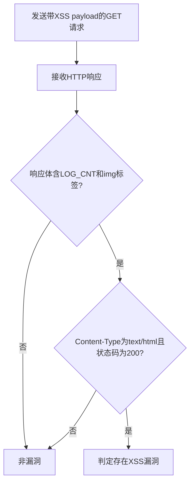

# Bitrix24 22.0.300 XSS漏洞（CVE-2023-1719）检测说明

## 漏洞简介

Bitrix24 22.0.300 存在全局变量提取导致的跨站脚本（XSS）漏洞。攻击者可通过未初始化变量覆盖，注入恶意JavaScript代码，进而在受害者浏览器中执行任意脚本，甚至在特定条件下执行PHP代码。

## 影响范围

- 产品：Bitrix24
- 影响版本：22.0.300
- CVE编号：CVE-2023-1719
- 危害等级：Critical

## 漏洞原理

/bitrix/components/bitrix/socialnetwork.events_dyn/get_message_2.php接口未对log_cnt参数进行有效过滤，攻击者可注入恶意HTML标签和事件处理脚本，触发XSS。

## 利用方式与攻击流程

1. 攻击者构造带有XSS payload的GET请求，log_cnt参数注入``。
2. 服务器端未对参数进行安全处理，直接插入到页面中。
3. 受害者访问该页面时，恶意脚本在其浏览器中执行。
4. 攻击者可窃取cookie、劫持会话等。

## 探测原理与流程

### 探测请求的构造

```http
GET /bitrix/components/bitrix/socialnetwork.events_dyn/get_message_2.php?log_cnt= HTTP/1.1
Host: target.com
```

- log_cnt参数注入了img标签和onerror事件。

### 预期响应与交互

- 响应体需包含`'LOG_CNT':`和``。
- 响应头包含`text/html`。
- HTTP状态码为200。

### 判定逻辑

```python
def is_vulnerable(response):
    if response.status_code == 200 and "'LOG_CNT':" in response.text and '' in response.text and 'text/html' in response.headers.get('content-type', ''):
        return True
    return False
```

### 检测流程Mermaid图



## 参考链接

- [StarLabs安全通告](https://starlabs.sg/advisories/23/23-1719/)
- [NVD官方漏洞库](https://nvd.nist.gov/vuln/detail/CVE-2023-1719)
- [GitHub工具](https://github.com/20142995/sectool) 